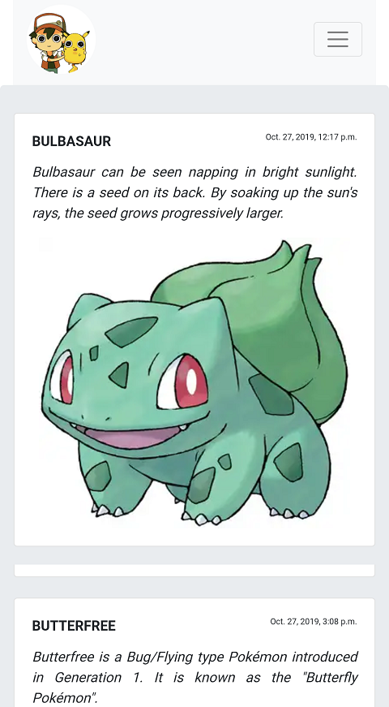

# Flutter_Android_App
<ul>
  <li> It is simple flutter android app.</li>
  <li> Basically I directly converted the web app into an android app.</li>
  <li> You can use this app structure in any of your projects by a little changes.</li>
  <li> Just replace the URL you want to make android app.</li>
  </ul>
  
 <h2>Used Flutter Packages<h2>
  <ul>
    <li> webview_flutter 0.3.15+1</li>
  </ul>

<h3> FLUTTER VERSION</h3>

 Flutter 1.9.1+hotfix.5

 

<h1> Some Screenshort of WebApp</h1>

  

<h1> Footer of this WebApp </h1>

